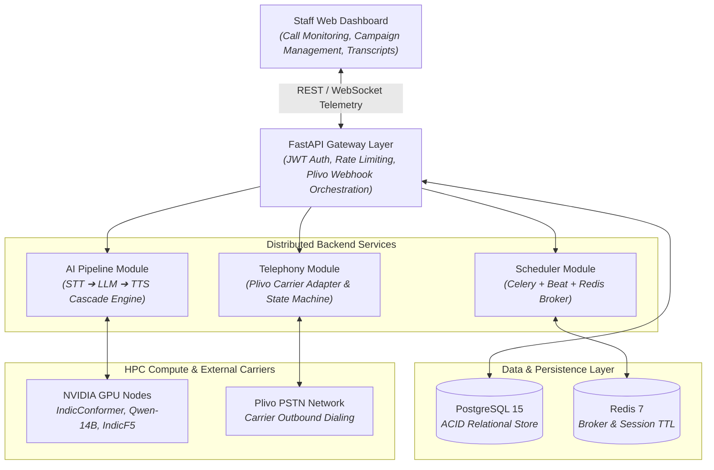

# Nirma AI Call Agent System

An enterprise-grade, automated multilingual outbound voice calling platform designed for college administration (Nirma University). The system places outbound calls to students and parents for fee reminders, examination schedules, attendance alerts, and official announcements in **English, Hindi, and Gujarati**.

---

## 🏛️ System Overview

The system operates on an on-premises local-first architecture deployed to the **Nirma University Supercomputer (HPC)**, combining local speech recognition (ASR), local large language models (LLM), and speech synthesis (TTS) with resilient cloud failovers.



---

## 📁 Repository Structure

```text
.
├── .agents/                    # Agent memory & workspace rules
│   └── rules/
│       └── engineering_standards.md
├── backend/                    # Core backend service package (FastAPI, Celery, AI Pipeline)
│   ├── ai_pipeline/            # STT, LLM, TTS model adapters & cloud fallbacks
│   ├── api/                    # REST API endpoints (auth, campaigns, calls, analytics)
│   ├── database/               # SQLAlchemy models & Alembic migrations
│   ├── scheduler/              # Celery tasks & periodic campaign dispatcher
│   ├── telephony/              # Plivo telephony adapter & webhook state machine
│   ├── websocket/              # Real-time WebSocket connection manager
│   └── README.md               # Backend detailed architecture & runbook
├── frontend/                   # Administrative Web Portal (React 19, Vite, Shadcn UI)
│   ├── src/                    # Components, views, and telemetry services
│   └── README.md               # Frontend design system, setup & user guides
├── docker/                     # Container orchestration & reverse proxy configs
│   └── nginx/                  # Nginx TLS, reverse proxy & WebSocket configs
├── docs/                       # Official system documentation & specifications
├── scripts/                    # Deployment & maintenance automation scripts
├── .env.example                # Configuration & environment variable template
├── .gitignore                  # Production Git exclusions
├── AGENTS.md                   # Agent memory & engineering guidelines
├── DESIGN.md                   # Production design system tokens & specifications
├── LICENSE                     # Project license
├── README.md                   # Project overview & documentation index
└── SYSTEM_ARCHITECTURE_AND_OPTIMIZATIONS.md # Technical optimizations & benchmarks
```

---

## 📚 Dedicated Module Documentation

- 🖥️ **[Frontend Web Portal Documentation](frontend/README.md)**: Design system tokens (`DESIGN.md`), Shadcn UI components, live WebSocket streaming console, campaign launcher, and audio transcript inspector.
- ⚙️ **[Backend Service Documentation](backend/README.md)**: AI pipeline latency budget, Dual-engine database isolation, Plivo webhook state machine, Celery scheduler, and Supercomputer deployment runbook.
- 📐 **[Design System Specifications](DESIGN.md)**: Color palette, typography scale, 4px spatial baseline, and accessibility invariants.


---

## 🛠️ Technology Stack

| Layer | Component | Technology | Role |
| :--- | :--- | :--- | :--- |
| **API & Webhooks** | Web Framework | FastAPI (Python 3.11) | Async REST API & Plivo Webhooks |
| **Database** | Relational DB | PostgreSQL 15 | Persistent ACID state & transcripts |
| **Queue / Cache** | Task Broker | Redis 7 | Celery broker, session cache (`TTL=600s`) |
| **Task Queue** | Background Jobs | Celery 5.x + Celery Beat | Scheduled call dispatch & retry logic |
| **Telephony** | PSTN Carrier | Plivo Voice API | Outbound dialing & call audio recording |
| **STT (Primary)** | Local ASR | IndicConformer 0.60B | Hindi, Gujarati, English recognition |
| **STT (Fallback)**| Cloud ASR | Sarvam AI API (`saaras:v4`) | Cloud speech-to-text fallback |
| **LLM (Primary)** | Local LLM | Qwen-14B (Ollama Q4_K_M) | Multilingual conversational reasoning |
| **LLM (Fallback)**| Cloud LLM | Groq API (`llama-3.3-70b`) | Ultra-low latency cloud inference |
| **TTS (Primary)** | Local TTS | IndicF5 0.40B | Voice synthesis for Indian languages |
| **TTS (Fallback)**| Cloud TTS | gTTS / Google Cloud | Fallback audio synthesis |

---

## 🚀 Deployment Lifecycle

1. **Stage 1 — Local Development**:
   - Developed, linted, and tested locally.
   - Webhook testing via secure tunnels (e.g., ngrok).
2. **Stage 2 — Nirma Supercomputer (HPC) Promotion**:
   - Deployed to Nirma University's high-performance supercomputing node via **SSH**.
   - Accessible via Nirma's institutional domain (e.g., `https://calls.nirmauni.ac.in`).
   - Hardware accelerated via the NVIDIA Container Toolkit (24 GB VRAM allocation).

---

## 📄 License

This project is licensed under the MIT License - see the [LICENSE](LICENSE) file for details.
