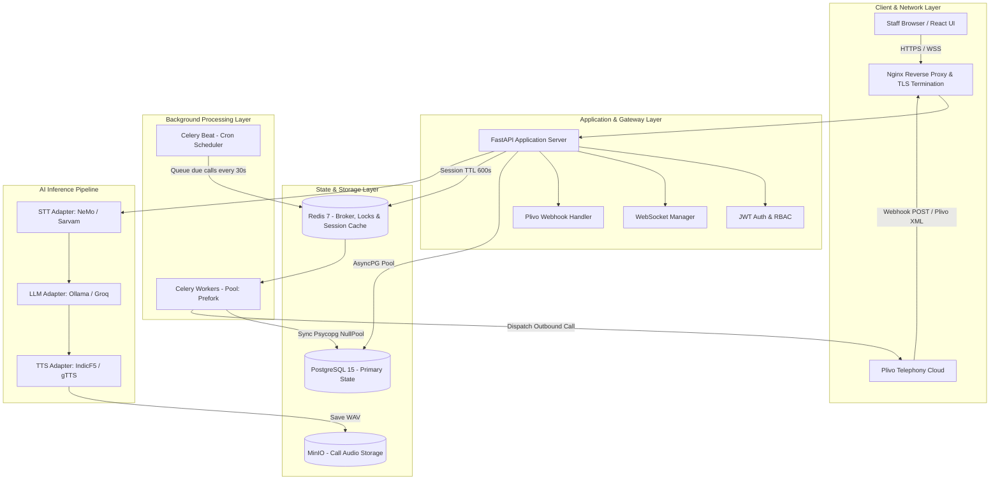
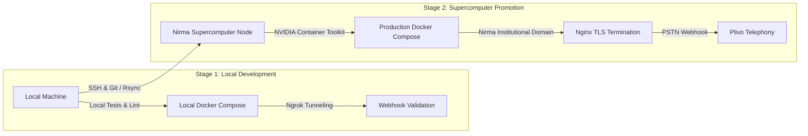

# AI Call Agent System — Enterprise Architecture, Industry Standards & Scaling Guide

**Project:** Automated Multilingual Outbound Calling Platform  
**Target Organization:** College Administration (Nirma University)  
**Classification:** Production Engineering Blueprint & Agent Memory Reference  
**Last Updated:** October 2026  

---

## 1. Executive Summary & Document Forensic Review

A thorough forensic audit of the four primary project documents (`PRD_AI_Call_Agent.pdf`, `SRS_AI_Call_Agent.pdf`, `System_Design_AI_Call_Agent.pdf`, and `AI_Build_Prompt.pdf`) was conducted against current industry benchmarks, live cloud telephony APIs, and distributed voice AI architectures.

While the foundational concept (outbound automated calling with local multilingual AI models and cloud failovers) is strong, **several critical implementation bugs, latent race conditions, and architectural contradictions** exist in the raw specifications.

This guide provides the **production-grade resolution** for every identified flaw, establishes strict coding and commenting guidelines, and defines the system's scaling blueprint.

---

## 2. Forensic Analysis: Bugs, Contradictions & Production Fixes

### 2.1 The Latency Paradox: Turn-Based HTTP vs. Real-Time Conversational UX
* **The Specification Conflict:** The PRD and SRS demand an end-to-end latency of **$\le$ 4.0 seconds** per conversational turn. However, the System Design and AI Build Prompt implement a turn-based HTTP webhook cycle using Plivo's `<Record>` tag:
  ```xml
  <Response>
    <Play>https://server/audio/reply.wav</Play>
    <Record action="/webhook/plivo/input?task_id=123" maxLength="30" silence="3" finishOnKey="#"/>
  </Response>
  ```
* **Real-World Turnaround Breakdown:**
  1. Silence detection threshold (`silence="3"`): **3.0 seconds**
  2. Plivo audio file finalization, cloud upload & webhook dispatch: **0.8 – 1.2 seconds**
  3. Server download of audio file via HTTP GET: **0.3 – 0.5 seconds**
  4. Local STT inference (IndicConformer on 5–10s audio): **1.0 – 1.5 seconds**
  5. Local LLM inference (Qwen-14B generating 30 words): **1.2 – 2.0 seconds**
  6. Local TTS synthesis (IndicF5 generating WAV): **0.5 – 1.0 seconds**
  7. Plivo audio fetch & play startup: **0.5 – 0.8 seconds**
  * **Actual Turn Latency: 7.3 to 10.0 seconds!**
* **Production Resolution:**
  - **Phase 1 (Immediate Optimization):** Reduce Plivo `silence` timeout from `3` to `1.5` seconds. Enforce strict LLM generation limits (maximum 30 words / 2 short sentences). Cache common greetings.
  - **Phase 2 (Enterprise Standard):** Migrate to Plivo's bidirectional streaming interface (`<Stream bidirectional="true">`) over WebSockets or integrate LiveKit SIP. Audio streams in 20ms chunks, local Silero VAD detects end-of-speech in 300ms, streaming LLM tokens pipe directly into chunked TTS, achieving a **1.0 to 1.5 second turnaround time with barge-in (interruption) support**.

---

### 2.2 Sarvam AI STT Fallback API Mismatch
* **The Bug in Specs:** The documentation attempts to send a JSON payload with a remote URL:
  ```python
  # BROKEN SPECIFICATION:
  resp = await client.post(
      "https://api.sarvam.ai/speech-to-text",
      headers={"api-subscription-key": self.api_key},
      json={"url": audio_url, "model": "saarika:v1", "language_code": "hi-IN"},
  )
  ```
* **Why it Crashes:**
  1. Sarvam AI's Speech-to-Text API expects raw binary audio sent via **`multipart/form-data`** (`file=@audio.wav`), not a JSON body with a URL.
  2. `saarika:v1` is deprecated. The current production model is **`saaras:v4`**, which natively supports 22 Indian languages and automatic code-mixing.
* **Production Implementation:**
  ```python
  async with httpx.AsyncClient() as client:
      # Step 1: Fetch audio bytes from carrier storage
      audio_stream = await client.get(audio_url, timeout=10.0)
      
      # Step 2: Dispatch multipart/form-data to Sarvam AI
      files = {"file": ("audio.wav", audio_stream.content, "audio/wav")}
      data = {"model": "saaras:v4", "language_code": context.get("lang", "hi-IN")}
      resp = await client.post(
          "https://api.sarvam.ai/speech-to-text",
          headers={"api-subscription-key": self.api_key},
          files=files,
          data=data,
          timeout=15.0,
      )
      resp.raise_for_status()
      transcript = resp.json().get("transcript", "")
  ```

---

### 2.3 Plivo Webhook Parameter Naming (`RecordUrl` vs `RecordingUrl`)
* **The Bug in Specs:** The AI Build Prompt references `RecordingUrl` in the incoming POST body.
* **Why it Crashes:** `RecordingUrl` is a **Twilio** parameter. When Plivo executes an `<Record action="...">` callback, it sends **`RecordUrl`**, along with `RecordingID` and `RecordingDuration`.
* **Production Implementation:**
  ```python
  # Defensively extract audio URL across providers
  audio_url = form_data.get("RecordUrl") or form_data.get("RecordingUrl")
  if not audio_url:
      logger.error("Missing audio recording URL in webhook payload: %s", form_data)
      raise HTTPException(status_code=400, detail="Missing recording URL parameter")
  ```

---

### 2.4 Database Driver Incompatibility: AsyncPG vs Synchronous Celery
* **The Bug in Specs:** The `.env` specifies `DATABASE_URL=postgresql+asyncpg://...`, while Celery tasks call synchronous SQLAlchemy ORM methods (`db.query(CallTask).get(...)`).
* **Why it Crashes:** `asyncpg` does not support synchronous database calls. Invoking `db.query()` on an `asyncpg` engine raises `sqlalchemy.exc.InvalidRequestError`.
* **Production Implementation:** Maintain dual database configurations in `database/session.py`:
  1. `async_session_factory`: Powered by `create_async_engine("postgresql+asyncpg://...")` for FastAPI routes and WebSocket handlers.
  2. `sync_session_factory`: Powered by `create_engine("postgresql+psycopg://...", poolclass=NullPool)` specifically for Celery worker processes.

---

### 2.5 GPU Hardware & VRAM Allocation Truth
* **The Contradiction:** SRS Assumption 1 states *"server has GPU with at least 8GB VRAM"*, whereas the System Design correctly identifies an RTX 3090/4090 with 24GB VRAM.
* **VRAM Math:**
  - `IndicConformer 0.60B` (NeMo): ~1.5 GB
  - `Qwen3-14B` (Ollama 4-bit Q4_K_M): ~9.2 GB
  - `IndicF5 0.40B` (TTS + Vocoder): ~1.8 GB
  - CUDA runtime overhead, context buffers, KV cache: ~2.5 GB
  - **Total Minimum VRAM: ~15 GB.** Running all three locally on an 8 GB card will result in an immediate `CUDA Out of Memory` kernel panic.

---

## 3. Industry-Standard Architecture & Scaling Patterns



### 3.1 Scaling & Concurrency Principles
1. **Stateless API Tier:** FastAPI processes retain zero conversational state in local memory. All call context is persisted in Redis with atomic TTL updates (`call:session:{call_uuid}`). Any API replica can handle any Plivo webhook callback.
2. **Connection Pooling Standards:**
   - FastAPI: `AsyncAdaptedQueuePool` with `pool_size=20`, `max_overflow=10`, `pool_recycle=1800`.
   - Celery: `NullPool` to prevent multiprocessing fork corruption.
3. **Task Idempotency & Concurrency Throttling:**
   - Inbound call dispatching is bounded to **10 calls per 30-second tick** to prevent channel exhaustion and avoid telecom spam scoring.
   - Database tasks check `WHERE status = 'pending' AND scheduled_at <= NOW() FOR UPDATE SKIP LOCKED` to prevent duplicate dialing across multi-worker setups.
4. **TRAI Telecom Regulations Compliance:**
   - Celery Beat must strictly gate call dispatches between **09:00:00 and 21:00:00 IST**.
   - Mandatory AI caller disclosure in the opening script.
   - Respect DND (Do Not Disturb) registries.

---

## 4. Code Quality, Typing & Commenting Standards

Every file in the codebase must follow these standards:

### 4.1 Module Header Template
```python
"""
<Module Name> — <Brief Subsystem Description>.

<Detailed technical description of this module's architectural role,
invariants, external dependencies, and thread/async safety guarantees.>

Design Patterns:
    - Adapter Pattern (for vendor independence)
    - Circuit Breaker / Graceful Fallback

Dependencies:
    - <Library 1>
    - <Library 2>

Author: Nirma University AI Call Agent Engineering Team
Version: 1.0.0
"""
```

### 4.2 Function & Class Documentation Standard (Google Style)
```python
async def execute_turn(
    self,
    audio_url: str,
    call_context: Dict[str, Any],
) -> str:
    """
    Executes a single conversational voice turn: STT -> LLM -> TTS.

    Coordinates the speech-to-text transcription, context-aware prompt
    generation, LLM inference, and speech synthesis with automatic
    failover to cloud providers if latency budgets are exceeded.

    Args:
        audio_url: Publicly accessible URL of the recorded caller audio.
        call_context: In-flight call session dictionary containing:
            - 'system_prompt': Active campaign script prompt.
            - 'history': List of previous conversational exchanges.
            - 'lang': Active language ISO code ('hi', 'gu', 'en').
            - 'turn': Current conversational turn index.

    Returns:
        str: Public static URL of the newly synthesized response WAV audio.

    Raises:
        PipelineProcessingException: If both primary and fallback engines fail.
        NetworkTimeoutException: If audio downloading fails after retries.

    Performance:
        Target turnaround: < 4000ms.
        STT budget: 1200ms | LLM budget: 1800ms | TTS budget: 600ms.
    """
```

### 4.3 Why-Centric Inline Comments
- Explain **algorithmic constraints** and **business logic**:
  ```python
  # Restrict history to the last 6 messages (3 conversational turns).
  # Telephony callers lose context beyond 3 exchanges, and pruning
  # keeps Ollama LLM prompt token processing under 250ms.
  truncated_history = call_context["history"][-6:]
  ```
- Explain **telephony edge cases**:
  ```python
  # Plivo SDK expects E.164 phone numbers with country code (+91 for India).
  # Ensure leading '+' is preserved and spaces/hyphens are stripped.
  normalized_phone = re.sub(r"[^\d+]", "", student_phone)
  ```

---

## 5. Agent Memory Directives & Prompt Engineering Safeguards

The following rules have been permanently embedded into the workspace configuration (`AGENTS.md` and `.agents/rules/engineering_standards.md`):

1. **Rule 1 — Zero Mock Implementations:** Never use placeholder text, dummy passwords, or incomplete mock methods. Generate fully operational, production-ready code.
2. **Rule 2 — Guarded Execution:** All network I/O must be guarded with explicit timeouts (`httpx.Timeout(connect=3.0, read=10.0)`).
3. **Rule 3 — Resource Lifecycle Safety:** Database sessions must use `async with async_session_factory() as session:`. Redis keys must always specify an expiration TTL.
4. **Rule 4 — Structured Logging:** Never use `print()`. Use Python's standard `logging` with structured JSON context (including `task_id`, `call_uuid`, and `turn_id`).
5. **Rule 5 — Verification Checklist:** Before completing any deliverable, review against the 7 Quality Gates defined in `AGENTS.md`.
6. **Rule 6 — Supercomputer Target & Domain Externalization:** Develop and test locally, but ensure all configurations, reverse proxies, and callback endpoints target the Nirma University Supercomputer accessed via SSH and bind dynamically to Nirma's assigned institutional domain.

---

## 6. Remote Supercomputer (HPC) & SSH Deployment Pipeline

### 6.1 Two-Stage Promotion Lifecycle


### 6.2 Nirma Institutional Domain Binding
- **University Domain Configuration**: Nirma University will allocate a dedicated institutional sub-domain (e.g., `calls.nirmauni.ac.in`).
- **Dynamic Endpoint Parameterization**:
  - `BASE_URL` in production `.env` is set to `https://calls.nirmauni.ac.in`.
  - All Plivo callback URLs (`answer_url`, `hangup_url`, `action`) must be built using `f"{settings.BASE_URL}/webhook/plivo/..."`.
  - Hardcoded `localhost`, `127.0.0.1`, or static IP addresses are strictly prohibited.
- **Nginx Reverse Proxy on Supercomputer**:
  - Supercomputer Nginx terminates TLS (via Nirma's institutional SSL certificate or automated ACME Let's Encrypt).
  - WebSockets (`/ws/calls`) must include:
    ```nginx
    proxy_http_version 1.1;
    proxy_set_header Upgrade $http_upgrade;
    proxy_set_header Connection "upgrade";
    ```
  - Plivo webhooks (`/webhook/plivo/`) proxy directly to the FastAPI container with Plivo IP range verification and cryptographic signature checks.

### 6.3 Automated SSH Deployment Runbook
All deployment actions on the supercomputer are executed headlessly over SSH. Below is the production deployment script pattern:

```bash
#!/usr/bin/env bash
# scripts/deploy_supercomputer.sh — Idempotent Remote SSH Deployment
set -euo pipefail

HPC_HOST="${1:-supercomputer.nirmauni.ac.in}"
HPC_USER="${2:-urva}"
REMOTE_DIR="/opt/nirma-ai-call-agent"

echo "==> Deploying to Nirma Supercomputer at ${HPC_USER}@${HPC_HOST}..."

ssh "${HPC_USER}@${HPC_HOST}" bash -s << 'EOF'
  set -euo pipefail
  cd /opt/nirma-ai-call-agent

  echo "--> Pulling latest changes..."
  git pull origin main

  echo "--> Verifying NVIDIA GPU visibility inside Docker..."
  docker run --rm --gpus all nvidia/cuda:12.2.0-base-ubuntu22.04 nvidia-smi

  echo "--> Building and starting containers..."
  docker compose -f docker-compose.yml up -d --build

  echo "--> Applying database migrations..."
  docker compose exec -T api alembic upgrade head

  echo "--> Verifying Ollama model status..."
  docker compose exec -T ollama ollama list | grep -q "qwen3:14b" || \
    docker compose exec -T ollama ollama pull qwen3:14b

  echo "--> Performing health-check..."
  curl -fsS http://localhost:8000/health || exit 1

  echo "==> Deployment successfully finished on Nirma Supercomputer!"
EOF
```

---

## 7. Enterprise Git Commit Standards (Conventional Commits v1.0)

To maintain a clean, auditable commit history suitable for continuous integration, peer review, and enterprise compliance:

### 7.1 Commit Message Structure
```text
<type>(<scope>): <concise imperative summary under 72 characters>

<Context & Motivation>: Paragraph explaining the engineering rationale and why this change was made.

### Architectural & System Highlights:
- Modular breakdown of changes by domain
- Data schema, concurrency, or performance implications
- Security, carrier, or deployment updates

### Compliance & Quality Verification:
- Traceability to PRD/SRS requirements
- Quality gates passed (PEP 8, strict typing, Google docstrings, zero plain-text secrets)

Refs: #<issue_number>
```

### 7.2 Semantic Types & Scopes
- **Types**: `feat` (new feature), `fix` (bug fix), `refactor` (code refactoring without feature change), `perf` (performance optimization), `chore` (scaffolding, maintenance, dependencies), `docs` (documentation only), `test` (test suite updates).
- **Scopes**: `architecture`, `telephony`, `ai-pipeline`, `stt`, `llm`, `tts`, `database`, `scheduler`, `api`, `websocket`, `security`, `deploy`.


