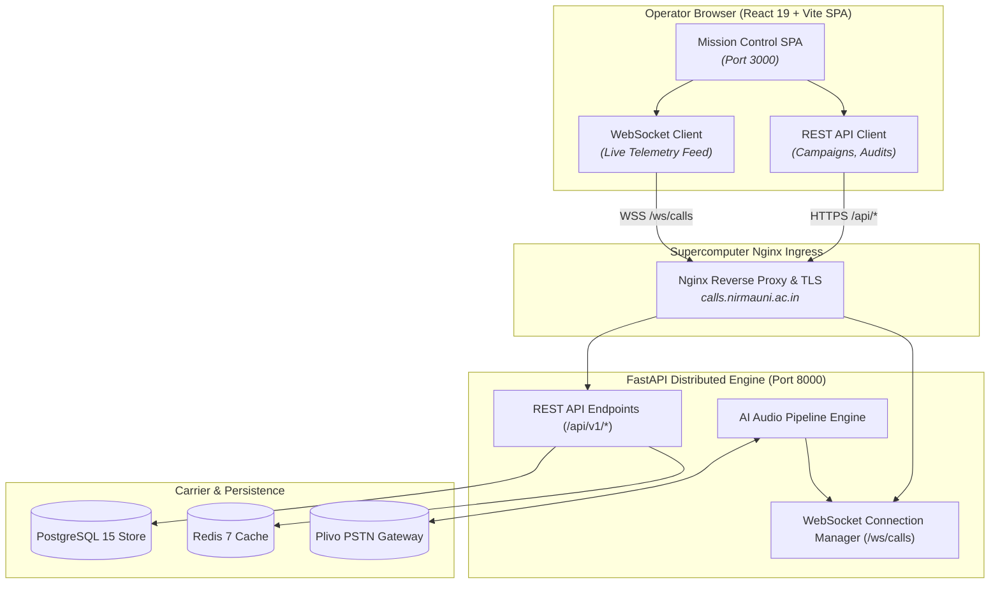
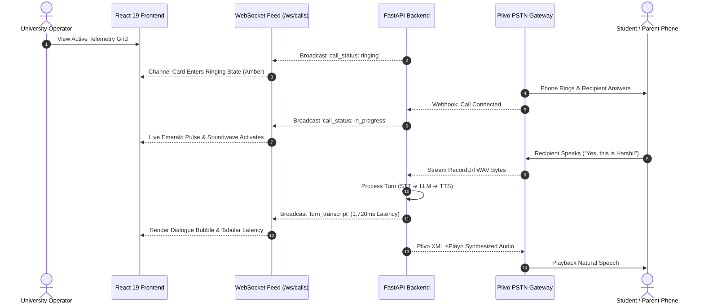
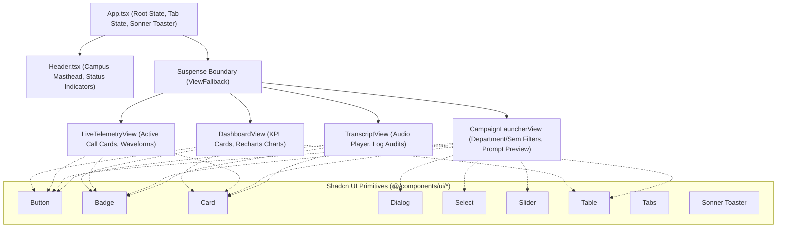

# Nirma University AI Voice Agent — Mission Control Web Portal

[](https://react.dev/)
[](https://www.typescriptlang.org/)
[](https://vite.dev/)
[](https://tailwindcss.com/)
[](https://ui.shadcn.com/)
[](../LICENSE)

The **Nirma University AI Voice Agent Mission Control** is a high-performance, real-time administrative frontend portal deployed on the **Nirma University Supercomputer (HPC)** infrastructure. It empowers academic deans, department heads, and tele-calling operators to orchestrate batch multilingual voice campaigns and monitor live active PSTN telephone calls with sub-second telemetry.

---

## Table of Contents

- [Architectural Overview](#architectural-overview)
- [Core Functional Modules](#core-functional-modules)
  - [1. Operational Dashboard & Analytics](#1-operational-dashboard--analytics)
  - [2. Live PSTN Call Telemetry Console](#2-live-pstn-call-telemetry-console)
  - [3. Outbound Campaign Launcher](#3-outbound-campaign-launcher)
  - [4. Conversation Transcripts & Audio Inspector](#4-conversation-transcripts--audio-inspector)
- [Design System & Tokens (DESIGN.md)](#design-system--tokens-designmd)
- [Shadcn UI Component Architecture](#shadcn-ui-component-architecture)
- [Directory Structure](#directory-structure)
- [Getting Started](#getting-started)
  - [Prerequisites](#prerequisites)
  - [Installation & Setup](#installation--setup)
  - [Build & Preview](#build--preview)
- [Telephony & Regulatory Compliance](#telephony--regulatory-compliance)
- [Backend Integration & Networking](#backend-integration--networking)

---

## Architectural Overview

The portal interfaces with the **FastAPI ASGI Backend** and **Plivo PSTN Telephony Gateway**, receiving live conversational turn transcripts, carrier connection events, and model latency metrics over persistent **WebSockets (`/ws/calls`)**.



---

## Core Functional Modules

### 1. Operational Dashboard & Analytics
- **Executive KPI Cards**: Real-time counters for Total Calls Placed, Connection Rate (%), Average Call Duration (sec), and Turn Turnaround Latency (ms).
- **Interactive Visualizations (Recharts)**:
  - 7-day daily volume area chart comparing scheduled vs. connected calls.
  - Donut chart depicting carrier call disposition breakdown (Completed, Busy, No Answer, Carrier Error).
- **AI Latency Budget Gauges**: Visual progress bars auditing sub-pipeline turnaround times against the `< 4,000 ms` strict SLA (IndicConformer ASR, Qwen-14B LLM, IndicF5 TTS).
- **Active Campaign Overview**: Progress bars tracking completion percentages of ongoing batches.

### 2. Live PSTN Call Telemetry Console



- **WebSocket Streaming Grid**: Live channel cards rendering carrier call states (`ringing`, `in_progress`, `completed`, `failed`).
- **Animated Audio Waveforms**: Dynamic soundwave equalizer indicating active speech activity on the phone line.
- **Turn-by-Turn Dialogue Stream**: Dual-sided bubbles separating AI caller utterances from recipient speech.
- **Per-Turn Turnaround Latency**: Millisecond timers showing exact time elapsed between student speech end and AI voice synthesis.
- **Operator Overrides**: Instant buttons to terminate calls or transfer active callers to a human operator desk.

### 3. Outbound Campaign Launcher
- **Granular Student Cohort Filters**:
  - Filter by Academic Department (CSE, IT, Mechanical, Civil, Pharmacy, Management).
  - Multi-select Semester chips (Sem 1 through Sem 8).
  - Attendance criteria slider (e.g., `< 75%` University mandate).
  - Fee payment status (Pending / Partial / All).
- **Verified Call Scripts**: Approved templates for Tuition Fee Reminders, Low Attendance Alerts, and Exam Notices in **Hindi, Gujarati, and English**.
- **Live Script Preview**: Displays system persona prompt and opening greeting.
- **Carrier Throttling**: Dialing rate limiter slider (10 to 60 calls/min) to prevent telecom carrier rejections.
- **Indian TRAI Compliance Lock**: Visual indicator enforcing the **09:00 - 21:00 IST** legal calling window.
- **Confirmation Flow**: Recipient calculator, dispatch summary card, and modal confirmation triggering a Sonner toast promise.

### 4. Conversation Transcripts & Audio Inspector
- **Searchable Archive**: Real-time filtering by roll number, student name, and phone number.
- **Simulated Carrier Audio Player**: Waveform audio visualizer with play/pause, scrubbable progress bar, and 1x / 1.25x / 1.5x playback speed controls.
- **Technical AI Audit Card**: Inspects exact provider attribution for each call session (`IndicConformer` vs `Sarvam AI`, `Qwen-14B` vs `Groq`, `IndicF5` vs `gTTS`).
- **One-Click Manual Retries**: Immediate re-queueing of unanswered calls to the Celery dispatcher.

---

## Design System & Tokens ([DESIGN.md](../DESIGN.md))

The user interface adheres strictly to the mission control tokens specified in [DESIGN.md](../DESIGN.md):

| Token Category | Hex / Token Value | Purpose / Architectural Role |
| :--- | :--- | :--- |
| **Canvas Root** | `#080C15` | Edge-to-edge deepest mission control background |
| **Canvas Subtle** | `#0A0E1A` | Sticky navigation masthead and table headers |
| **Canvas Soft** | `#0D1322` | Standard card surface, dialogs, and form panels |
| **Canvas Elevated**| `#131B2E` | Floating context popovers and audio console |
| **Primary Brand** | `#E06D3B` | Nirma Terracotta brand accent (hover: `#F08252`, deep: `#993416`) |
| **Live Emerald** | `#10B981` | Active PSTN audio waveforms and connected calls |
| **Telemetry Cyan**| `#06B6D4` | Local GPU/LLM inference telemetry readouts |
| **TRAI Amber** | `#F59E0B` | Regulatory calling windows, ringing states, and carrier retries |
| **Hairline Border**| `rgba(255, 255, 255, 0.08)` | 1px border for all cards, tables, and dividers |

### The Tabular Numbers Invariant
Every metric, phone number, timestamp, call UUID, and latency timer uses `tabular-nums` (`font-variant-numeric: tabular-nums`) to prevent layout jitter during live WebSocket updates.

### Spatial Rhythm & Standard Control Height
Built on a strict **4px baseline grid** with a standard **32px control height** (`h-control`) across all buttons, text inputs, and select triggers.

---

## Shadcn UI Component Architecture

In compliance with repository guidelines, **zero hand-crafted primitive components** are used. All primitives are imported directly from `@/components/ui/*`:



- `button.tsx`: Tailored with variants (`default`, `outline`, `secondary`, `destructive`, `ghost`, `cyan`, `emerald`).
- `card.tsx`: Dark mission control glass panels.
- `badge.tsx`: Telecom semantic badges (`live`, `ringing`, `amber`, `cyan`, `mono`).
- `dialog.tsx`: Accessible modal dialogs powered by Radix UI.
- `select.tsx`: Custom styled accessible dropdown triggers and popovers.
- `table.tsx`: Data tables with uppercase monospace headers.
- `sonner.tsx`: Notification toaster mounted once at root (`App.tsx`) supporting `toast.promise`.
- `input.tsx`, `slider.tsx`, `progress.tsx`, `avatar.tsx`, `tabs.tsx`.

---

## Directory Structure

```text
frontend/
├── public/                     # Static assets and favicon
├── src/
│   ├── assets/                 # SVGs and images
│   ├── components/
│   │   ├── ui/                 # Shadcn UI Radix Primitives
│   │   │   ├── avatar.tsx
│   │   │   ├── badge.tsx
│   │   │   ├── button.tsx
│   │   │   ├── card.tsx
│   │   │   ├── dialog.tsx
│   │   │   ├── input.tsx
│   │   │   ├── progress.tsx
│   │   │   ├── select.tsx
│   │   │   ├── slider.tsx
│   │   │   ├── sonner.tsx
│   │   │   ├── table.tsx
│   │   │   └── tabs.tsx
│   │   ├── CampaignLauncherView.tsx  # Outbound Campaign Wizard
│   │   ├── DashboardView.tsx         # KPI Analytics & Recharts
│   │   ├── Header.tsx                # Masthead & Telemetry Status Bar
│   │   ├── LiveTelemetryView.tsx     # Real-time WebSocket Streaming
│   │   └── TranscriptView.tsx        # Conversation Transcript & Audio
│   ├── lib/
│   │   └── utils.ts            # clsx & tailwind-merge helper (cn)
│   ├── services/
│   │   └── api.ts              # Data contracts, DTOs & mock seed fixtures
│   ├── App.tsx                 # Root application state & Toaster mount
│   ├── index.css               # Design tokens, scrollbar & base styles
│   └── main.tsx                # React DOM entrypoint
├── index.html                  # HTML template with Outfit & JetBrains Mono
├── package.json                # Pinned dependencies
├── tailwind.config.js          # DESIGN.md token bindings & animation keyframes
├── tsconfig.app.json           # TypeScript configuration with @/* alias
└── vite.config.ts              # Vite configuration with port 3000
```

---

## Getting Started

### Prerequisites
- **Node.js**: `v20.0.0` or higher (tested on `v24.21.0`)
- **npm**: `v10.0.0` or higher

### Installation & Setup

1. Navigate to the frontend directory:
   ```bash
   cd frontend
   ```

2. Install dependencies:
   ```bash
   npm install
   ```

3. Launch the local development server:
   ```bash
   npm run dev
   ```

4. Open your browser at [http://localhost:3000](http://localhost:3000).

### Build & Preview

To validate TypeScript compilation and create an optimized production bundle:
```bash
npm run build
```

To preview the built production bundle locally:
```bash
npm run preview
```

---

## Telephony & Regulatory Compliance

The frontend portal enforces Indian telecom regulations (Telecom Regulatory Authority of India - TRAI):
1. **Permitted Calling Hours**: Automated dialer campaigns display active alerts for the **09:00:00 to 21:00:00 IST** operational window.
2. **AI Transparency**: Previews confirm that the opening spoken turn explicitly identifies the caller as an automated AI system of Nirma University.
3. **Audit Trail**: Every completed call preserves full turn transcripts and recording links for institutional compliance.

---

## Backend Integration & Networking

- **REST Endpoints**: Calls proxy to the FastAPI backend running on port `8000`:
  - `GET /api/v1/campaigns` & `POST /api/v1/campaigns`
  - `GET /api/v1/calls/{id}/transcript`
  - `GET /api/v1/analytics/dashboard`
- **WebSocket Gateway**: Live telemetry streams through `ws://localhost:8000/ws/calls` (or `wss://calls.nirmauni.ac.in/ws/calls` in production).
- **Reverse Proxy**: In production, Nginx terminates TLS on the supercomputer node and proxies `/` to the frontend static build, `/api/` to FastAPI, and `/ws/` to the WebSocket gateway.
